# Manual ERP - Odoo 19 · Alexandra Rivas Y Oscar Sánchez
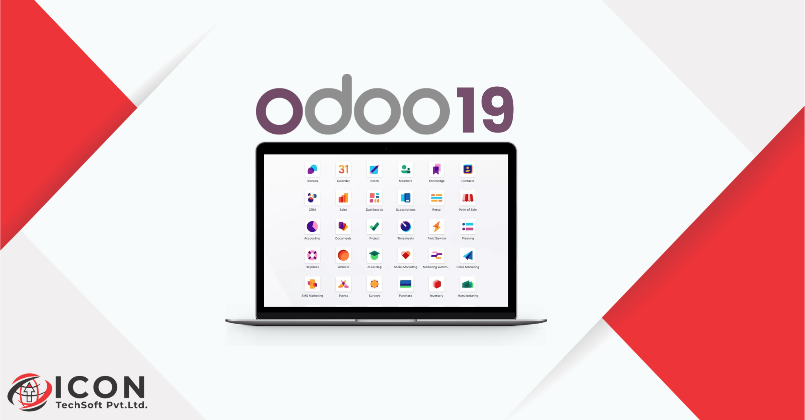

**Alexandra Rivas y Oscar Sanchez** 
**RA7 - ERP2**
**Fecha:** 30/04/2026
**Profesor:** Alberto de Santos

-----
## Índice

- [1. Instalación de Odoo](#1-instalación-de-odoo)
  - [1.1 Registro en la web oficial](#11-registro-en-la-web-oficial)
  - [1.2 Descargar el instalador](#12-descargar-el-instalador)
  - [1.3 Ejecutar el instalador](#13-ejecutar-el-instalador)
  - [1.4 Instalación asistida](#14-instalación-asistida)
  - [1.5 Crear la base de datos](#15-crear-la-base-de-datos)
- [2. Módulo de Ventas — Alexandra](#2-módulo-de-ventas--alexandra)
  - [2.1 Activar el módulo](#21-activar-el-módulo)
  - [2.2 Creación de clientes](#22-creación-de-clientes)
  - [2.3 Creación de productos](#23-creación-de-productos)
  - [2.4 Creación de presupuesto](#24-creación-de-presupuesto)
  - [2.5 Creación de factura](#25-creación-de-factura)
- [3. Módulo de Inventario — Oscar](#3-módulo-de-inventario--oscar)
  - [3.1 Activar el módulo](#31-activar-el-módulo)
  - [3.2 Vista general del inventario](#32-vista-general-del-inventario)
  - [3.3 Crear un registro de recepción](#33-crear-un-registro-de-recepción)
  - [3.4 Validar el registro](#34-validar-el-registro)
  - [3.5 Ver y filtrar los registros](#35-ver-y-filtrar-los-registros)
  - [3.6 Cambiar el formato de visualización](#36-cambiar-el-formato-de-visualización)
- [4. Backups y Restauración](#4-backups-y-restauración)
  - [4.1 Primera manera](#41-primera-manera--desde-la-configuración-del-usuario)
  - [4.2 Segunda manera](#42-segunda-manera--desde-el-gestor-de-bases-de-datos)
  - [4.3 Verificación del backup](#43-verificación-del-backup)
  - [4.4 Restauración desde el backup del compañero](#44-restauración-desde-el-backup-del-compañero-oscar)

## 1. Instalación de Odoo

Para instalar Odoo primero hay que ir a su página oficial y registrarse. 
Te pedirá unos datos básicos antes de dejarte descargar el instalador.

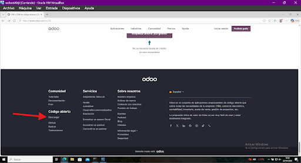

----

### 1.1 Registro en la web oficial

Ve a **[`odoo.com`](https://www.odoo.com)** y rellena el formulario con los datos de tu empresa:

| Campo | Descripción |
| :--- | :--- |
| **Tu empresa** | Nombre de la empresa ( `Empresa025_NombreApellido`) |
| **Tu nombre** | Un nombre completo |
| **Número de teléfono** | Con prefijo de país |
| **Tu correo electrónico** | El que uses habitualmente |
| **Interés principal** | Selecciona "Usarlo en mi empresa" o "Soy estudiante" |
| **Tamaño de la empresa** | Menos de 5 empleados |

| Alexandra | Oscar |
|-----------|-------|
| 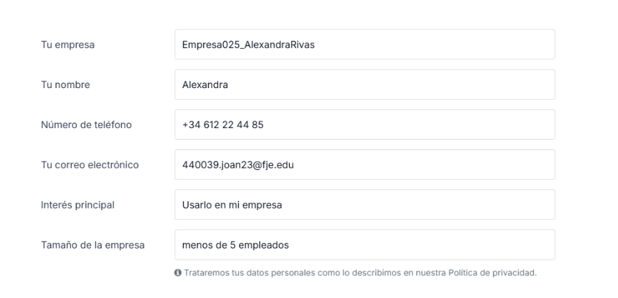 | 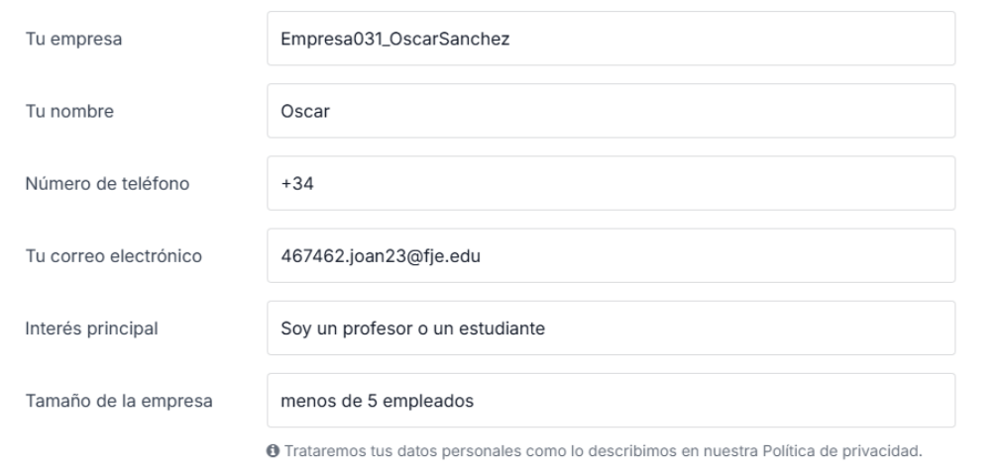 |

-----

### 1.2 Descargar el instalador

Una vez rellenado el formulario, la web te lleva a la pantalla de descarga. Odoo 19 tiene dos ediciones:

* **Community** --> gratuita, código abierto.
* **Enterprise** --> de pago, con más funciones.

Para esta práctica usamos la versión **Community para Windows**.
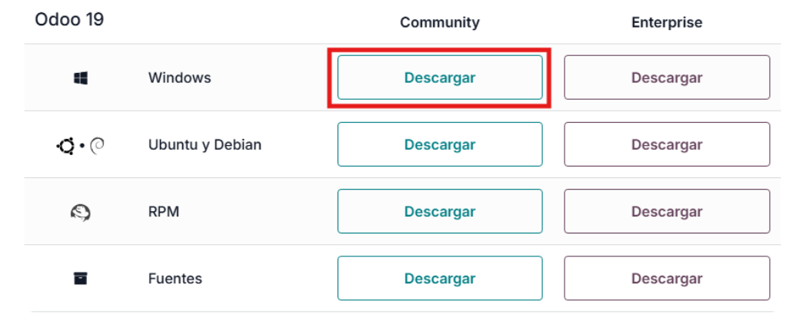

------
### 1.3 Ejecutar el instalador

Una vez descargado el `.exe`, haz doble clic para abrirlo. Windows te pedirá permiso para hacer cambios en el equipo, le damos a **Sí**.
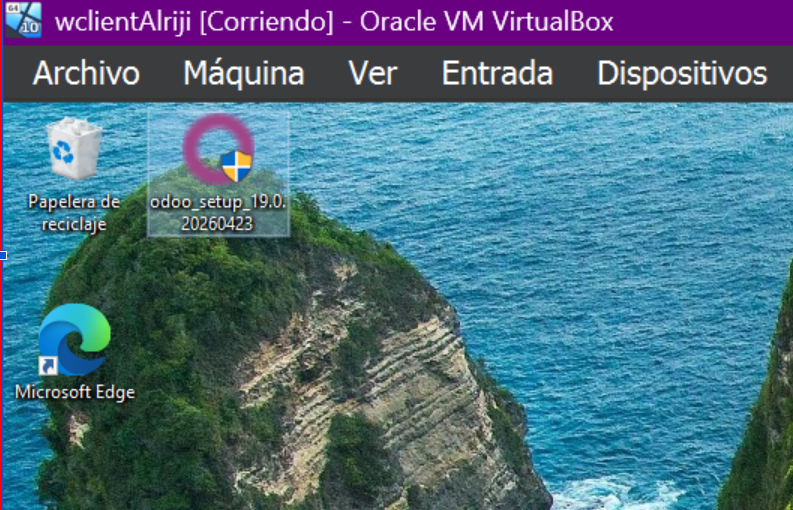

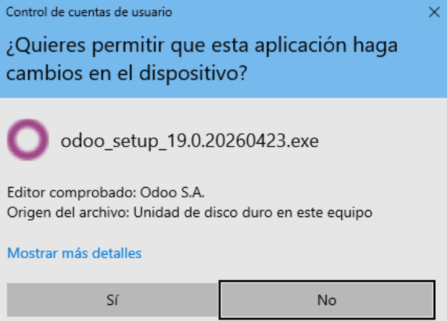

-----
### 1.4 Instalación asistida

El instalador te guía paso a paso. Solo hay que tocar una pantalla concreta (la de la base de datos), el resto se deja por defecto.

**Paso 1 — Selección de idioma**

El primer paso que aparece es elegir el idioma del instalador. Selecciona **English** y dale a OK.
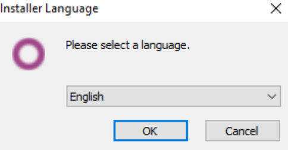

**Paso 2 — Pantalla de bienvenida**

Haz clic en **Next** para continuar.

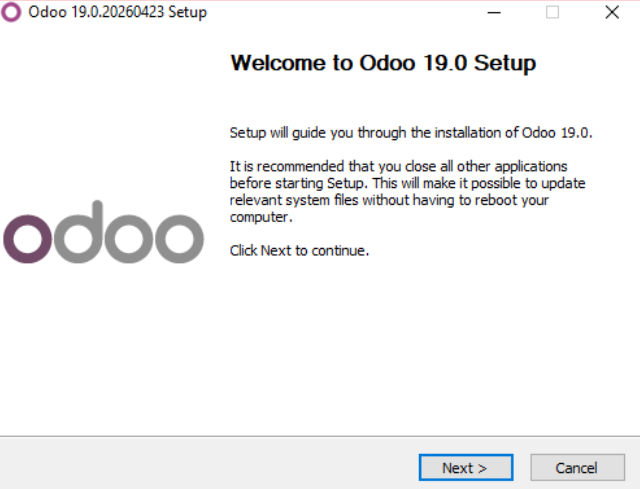

**Paso 3 — Licencia**

Lee los términos y haz clic en **I Agree** para aceptarlos y seguir.
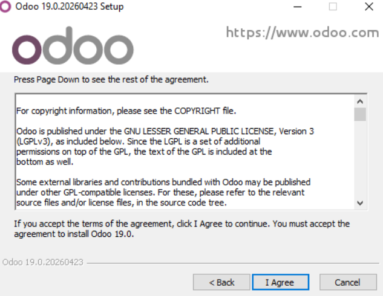

**Paso 4 — Componentes a instalar**

Deja marcadas las dos opciones por defecto: **Odoo Server** y **PostgreSQL Database**. Haz clic en **Next**.
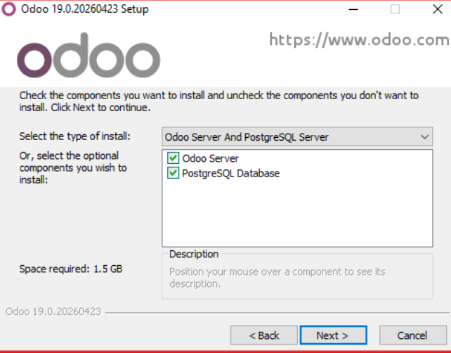

**Paso 5 — Configuración de la base de datos** 

Esta es la pantalla más importante. Aquí es donde tienes que cambiar el usuario y la contraseña de PostgreSQL. Ponlos como prefieras, pero anótalos porque los necesitarás después.

| Campo | Valor de ejemplo |
| :--- | :--- |
| **Hostname** | localhost |
| **Port** | 5432 |
| **Username** | root |
| **Password** | Una contraseñaa |

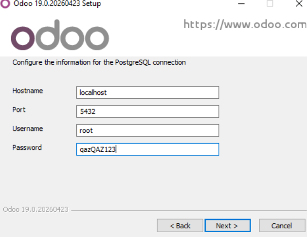

**Paso 6 — Ruta de instalación**

Deja la ruta por defecto (`C:\Program Files\Odoo 19...`) y haz clic en **Install**.

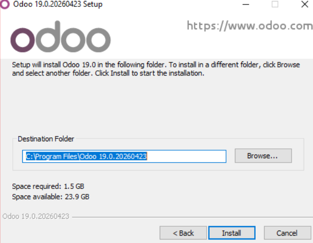

**Paso 7 — Progreso de la instalación**

El instalador extrae los archivos. No hay que hacer nada, solo esperar.
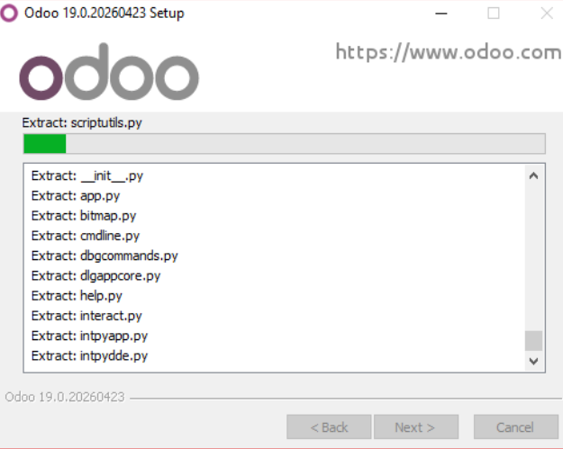

**Paso 8 — Finalizar**

Cuando termina aparece la pantalla "Completing Odoo 19.0 Setup". Deja marcada la opción **Start Odoo** y haz clic en **Finish**.

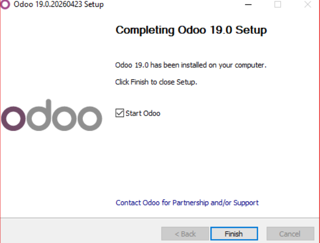

-------
### 1.5 Crear la base de datos

Al hacer clic en Finish, Odoo abre automáticamente el navegador en `localhost` para configurar la base de datos. Odoo genera una **Master Password** automáticamente — **guárdala**, te la pedirá para operaciones futuras con la base de datos.

Rellena el formulario con tus datos:

| Campo | Descripción |
| :--- | :--- |
| **Master Password** | La que te genera Odoo automáticamente (**no la cambies**) |
| **Database Name** | Un nombre identificativo, `db_Oscar` o `db_Alexandra` |
| **Email** | Tu correo de acceso |
| **Password** | Contraseña con la que entrarás a Odoo |
| **Language** | Spanish / Español |
| **Country** | Spain |
| **Demo Data** | Marcado (carga datos de ejemplo para practicar) |

| Oscar | Alexandra |
|-------|-----------|
| 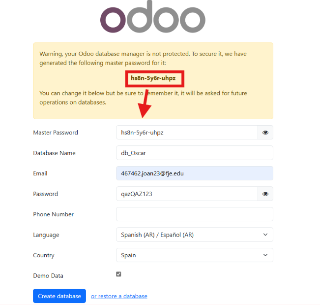 | 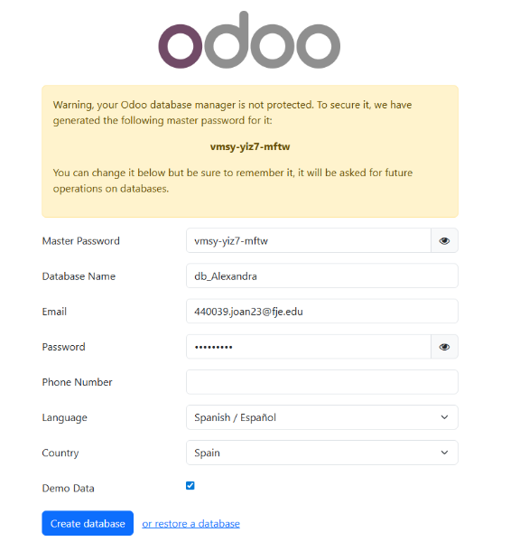 |

Una vez relleno, haz clic en **Create database**. Puede tardar unos minutos. Cuando termina, te redirige directamente a la pantalla de inicio de Odoo donde puedes elegir los módulos que quieres activar.

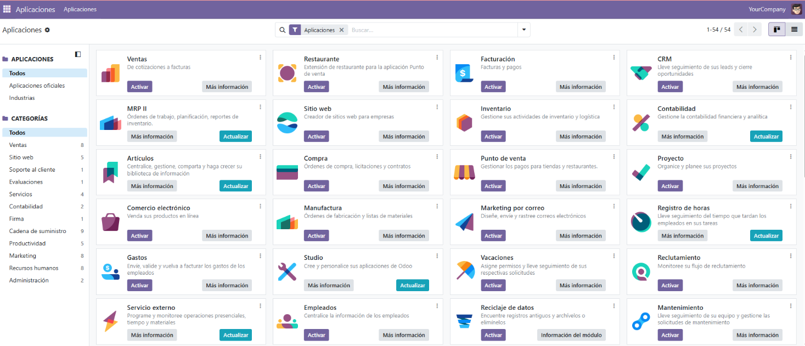

## 2. Módulo de Ventas — Alexandra

El módulo de Ventas gestiona todo el ciclo comercial: desde crear un presupuesto hasta generar y cobrar una factura.

------

### 2.1 Activar el módulo

Para instalar el módulo, basta con ir al apartado de **Aplicaciones** y buscar **Ventas**.
Al darle a **Activar**, el sistema hace la instalación solo y configura todo lo necesario.

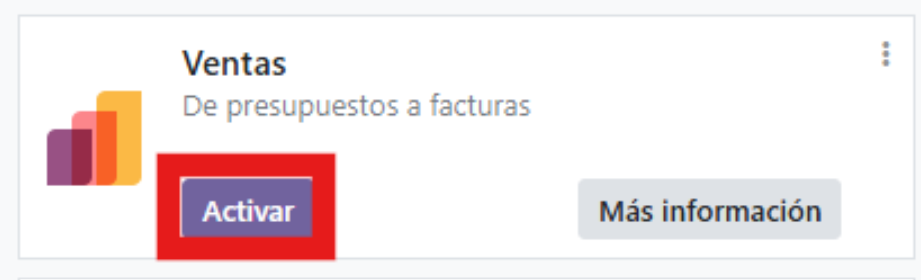

Una vez termina, el programa te lleva directamente a la **pantalla de inicio** del módulo.
Aquí ya aparecen los presupuestos creados; en este caso, se ven los **datos de prueba** que vienen por defecto para ver cómo queda la lista.

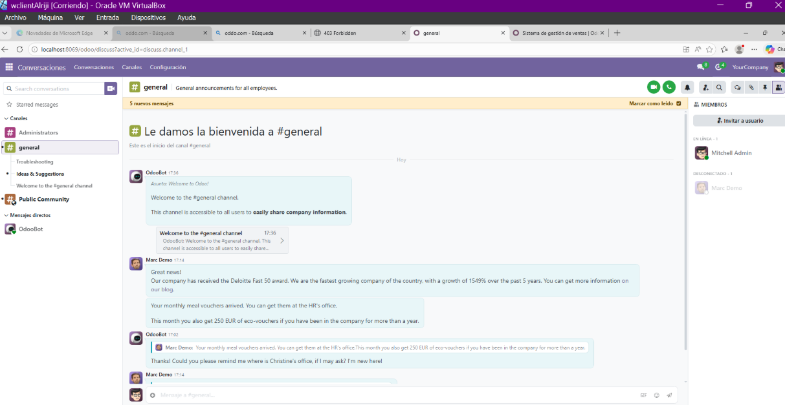

Para entrar al módulo después de instalarlo, solo hay que abrir el **menú de aplicaciones** arriba a la izquierda y hacer clic en **Ventas**. 
Desde aquí se puede saltar directamente a la sección.

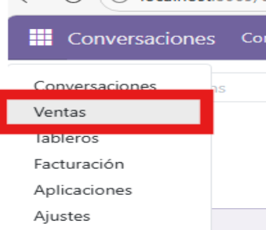

-----

### 2.2 Creación de clientes

Si entramos en la pestaña de **Pedidos** y seleccionamos **Clientes**, nos aparece la base de datos con toda la información de contacto. 
Para añadir a alguien nuevo, simplemente hay que darle al botón de **Nuevo** arriba a la izquierda.

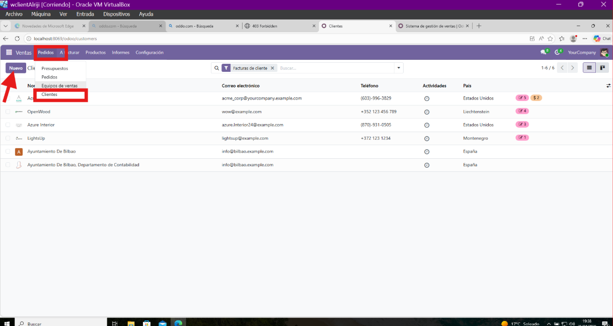

Una vez rellenados los datos del nuevo cliente, como el nombre, correo y dirección, hay que confirmar los cambios dando clic en el icono de la **nube (Guardar manualmente)** que aparece arriba. 
Con esto, el contacto ya queda registrado en el sistema. 
Lo mismo se hará para crear el usuario **Oscar Sánchez**.

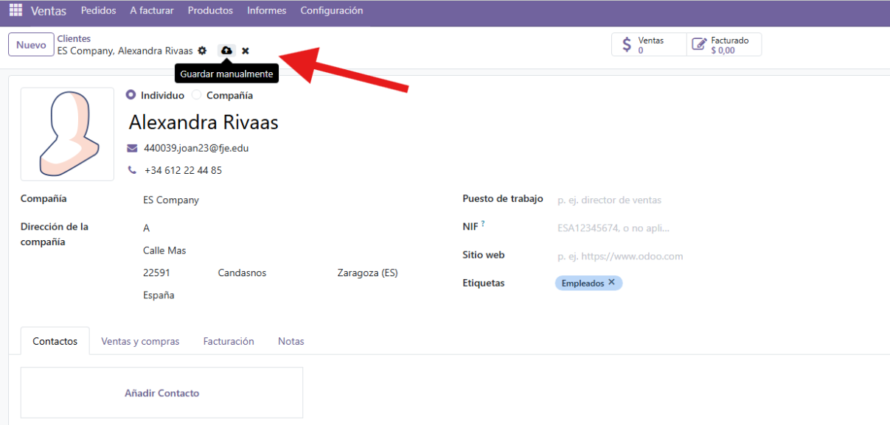

Cuando volvemos a la lista general de clientes, podemos ver que los nuevos contactos ya aparecen registrados correctamente. 
En la tabla se muestra un resumen con su nombre, correo y teléfono, lo que permite comprobar de un vistazo que toda la información se ha guardado bien y que el cliente ya está disponible.

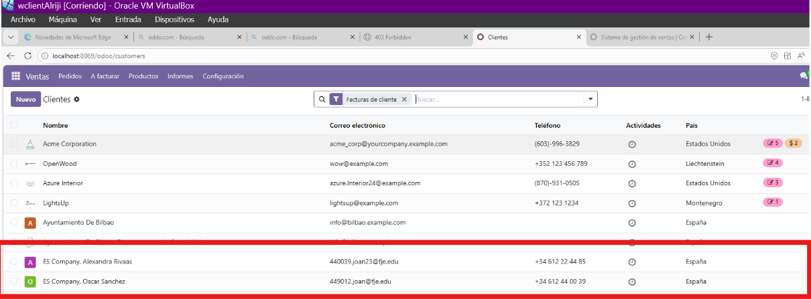

-----

### 2.3 Creación de productos

Entramos en la pestaña de **Productos**. 
Aquí aparece una vista en cuadrícula con todo lo que tenemos a la venta, incluyendo fotos y precios. 
Para añadir un artículo nuevo, solo hay que pulsar el botón **Nuevo** para abrir la ficha y configurar sus características.

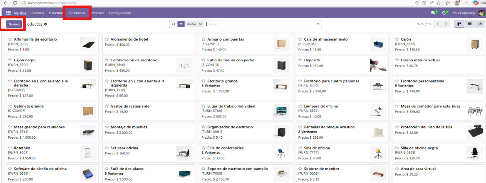

Al crear un producto nuevo, rellenamos los campos básicos como el **nombre**, el **precio de venta** y el **coste**. 
Una vez listo, se guarda para que ya aparezca disponible al hacer presupuestos.

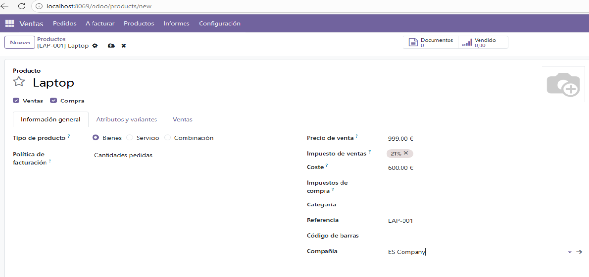

Al volver a la vista general, podemos comprobar que el nuevo producto **(Laptop)** ya aparece en el catálogo con su **referencia interna** y su **precio**. Así es mucho más fácil confirmar que se ha guardado bien y que ya podemos seleccionarlo al crear pedidos de venta.

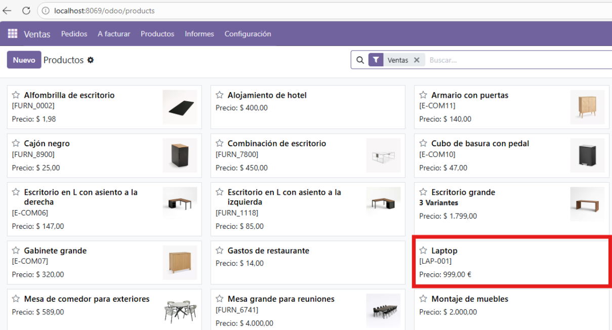

-----

### 2.4 Creación de presupuesto

Para empezar con una venta, vamos a la pestaña de **Pedidos** y seleccionamos **Presupuestos**. 
Desde aquí es donde se gestionan todas las ofertas iniciales que enviamos a los clientes antes de que se conviertan en un **pedido firme**.

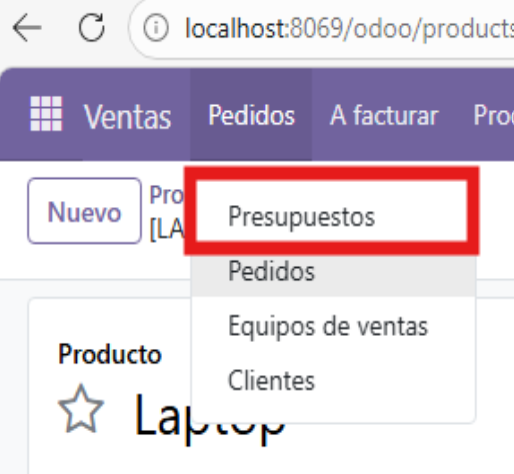

Al crear el presupuesto, seleccionamos al cliente **(Alexandra, el que creamos)** y añadimos los productos que nos ha pedido, como el **Laptop** que configuramos antes. 
El sistema calcula automáticamente el **importe base** y los **impuestos**, mostrando el total en la parte inferior. 
En la derecha, podemos ver que el presupuesto ya se ha convertido en un **Pedido de venta**, lo que significa que la operación ya está confirmada y lista para facturarse.

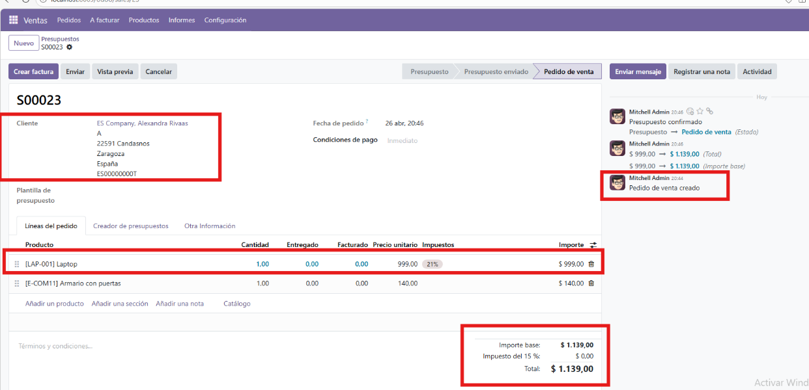

------

### 2.5 Creación de factura
Una vez que el pedido de venta está confirmado, el siguiente paso es pulsar el botón **Crear factura** que aparece en la parte superior izquierda. 
Al hacer esto, el sistema vincula automáticamente todos los datos del cliente y los productos del pedido para generar el **borrador de la factura**.

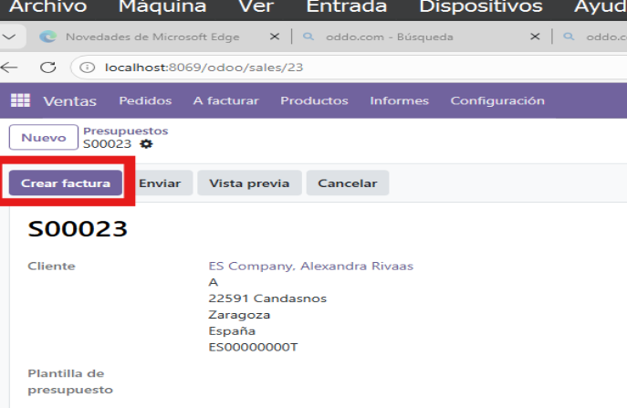

Al darle a crear factura, se nos abre una ventana emergente para elegir el tipo de facturación. 
Le daremos en marcar **Factura normal** para cobrar el total, pero también nos da la opción de:
| Opción | Cuándo usarla |
| :--- | :--- |
| **Factura normal** | Para cobrar el total del pedido |
| **Anticipo (porcentaje)** | Si el cliente paga un % por adelantado |
| **Anticipo (importe fijo)** | Si el cliente paga una cantidad fija por adelantado |

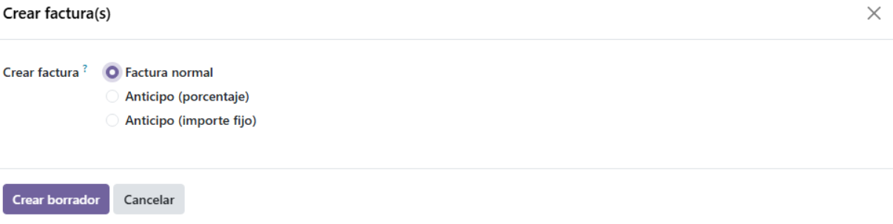

Para terminar el proceso, una vez generado el borrador de la factura con todos los datos del pedido, solo queda revisar que todo esté correcto y pulsar en **Confirmar**. 
Al hacerlo, la factura deja de ser un borrador para convertirse en un **documento oficial** registrado en el sistema y permite realizar el seguimiento del pago.

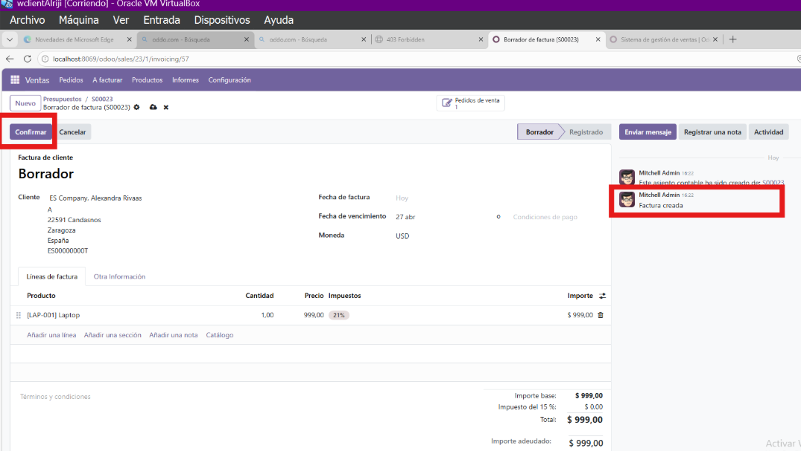

Una vez confirmada la factura, el estado cambia de **"Borrador"** a **"Registrado"** y se le asigna un número de serie oficial (`INV/2026/00010`). 
En este punto, ya aparecen las opciones finales para gestionar el documento; para visualizar mejor la factura le damos en **"Vista previa"**.

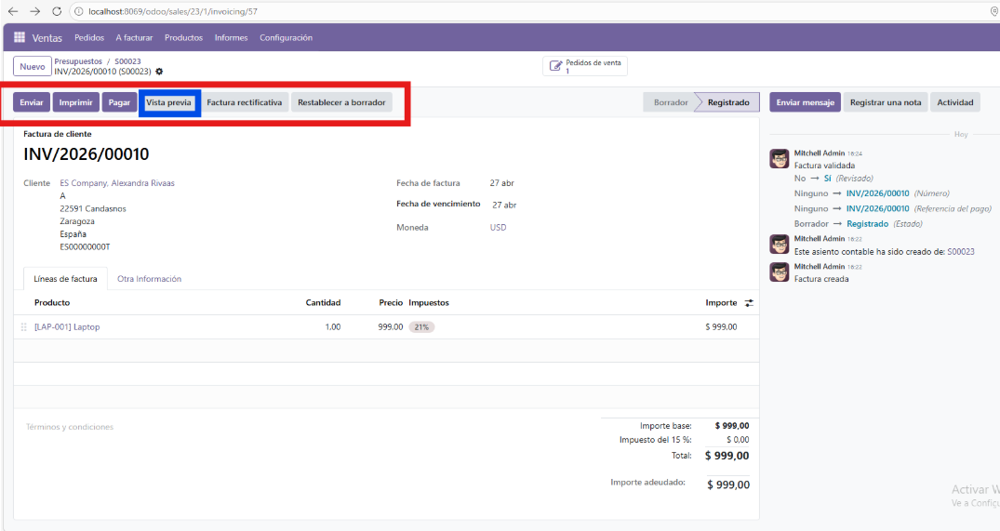

Aquí podemos ver la vista previa de la factura tal cual le llegaría al cliente. 

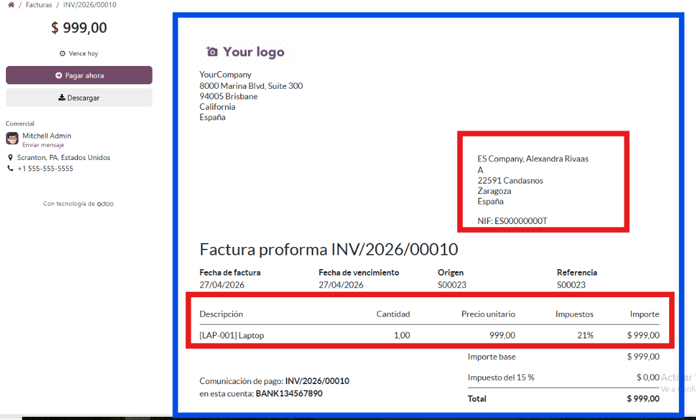

Aquí podemos ver la lista completa de facturas registradas en el sistema.
La nuestra aparece la primera, vinculada a **ES Company, Alexandra Rivas**, con estado **Registrado**.

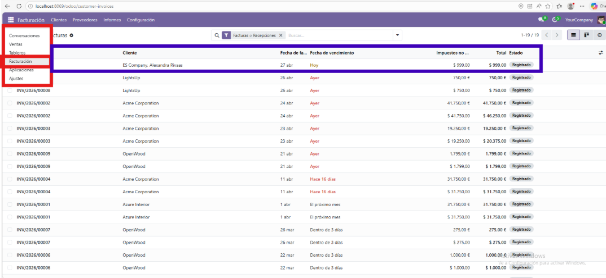

---------

## 3. Módulo de Inventario — Oscar

El módulo de Inventario gestiona las entradas y salidas de mercancía del almacén: recepciones de proveedores, órdenes de entrega a clientes, etc.

### 3.1 Activar el módulo
Ve a **Aplicaciones**, busca **Inventario** y haz clic en **Activar**.

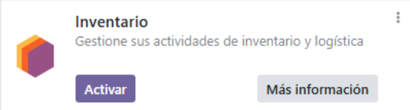

Al activarlo te pedirá que rellenes unos datos básicos de la empresa. Una vez completados, el sistema te llevará directamente a la pantalla de inicio del módulo.

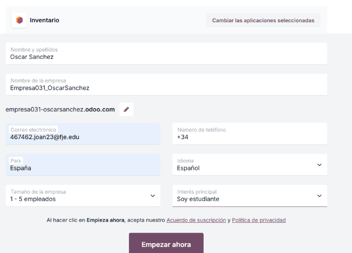

Cuando le demos a empezar nos enviaran un correo para crear la base de datos.
Una vez creada te llevará a la pantalla de inicio y seleccionamos Inventario.

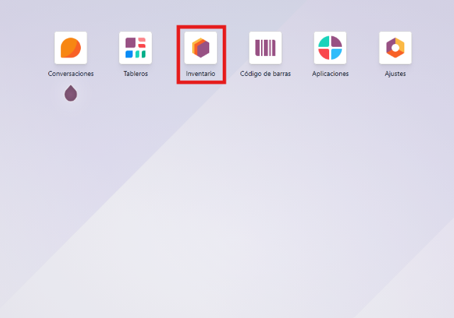

-------

### 3.2 Vista general del inventario

Dentro del módulo, la pantalla principal muestra el **Resumen de inventario** con dos secciones:

* **Recepciones** --> productos que recibes de proveedores.
* **Órdenes de entrega** --> productos que envías a clientes.

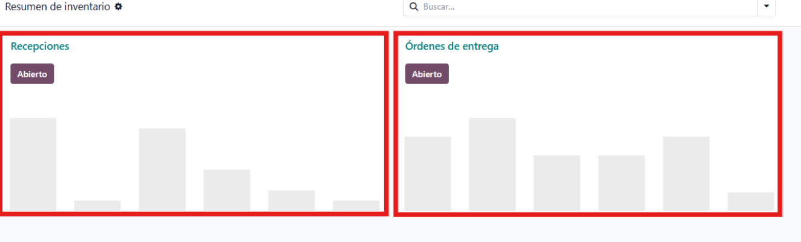

Para activar el módulo de inventario y empezar a usarlo, haz clic en **Nuevo** desde la ficha del módulo.

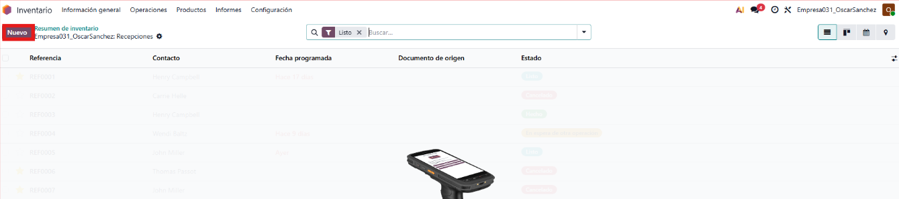

### 3.3 Crear un registro de recepción

Entra en **Recepciones** y haz clic en **Nuevo** para crear un registro de entrada de mercancía.
Rellena los campos del registro:

| Campo | Descripción |
| :--- | :--- |
| **Recibir de** | Nombre de la empresa proveedora (`Ejemplo`) |
| **Producto** | Los productos que recibes |
| **Demanda** | La cantidad de cada producto |
| **Documento de origen** | Número de factura o albarán (ej: `FA001`) |
| **Fecha programada** | Fecha prevista de llegada |

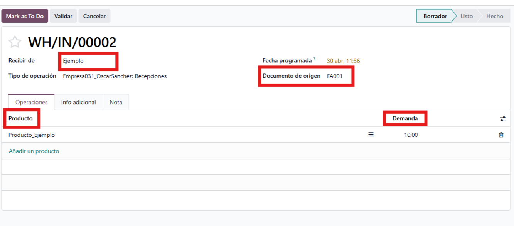

En la pestaña **Info adicional** puedes asignar un responsable del encargo.

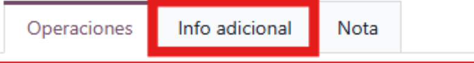

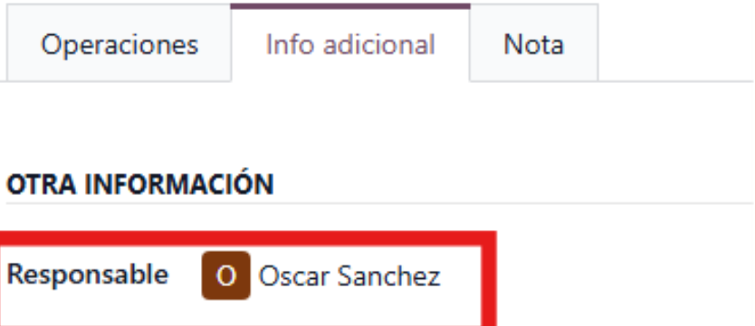

Y en la pestaña **Nota** puedes añadir una nota interna que se imprimirá en la hoja de operaciones.

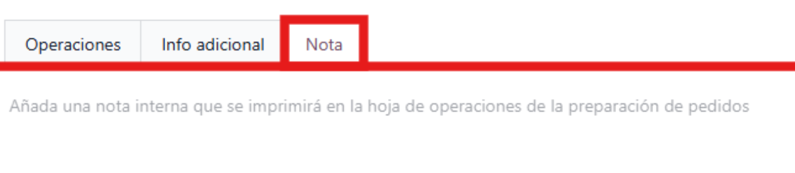

En la parte derecha del registro tienes un panel donde puedes chatear, dejar mensajes o ver el historial de acciones del traslado.

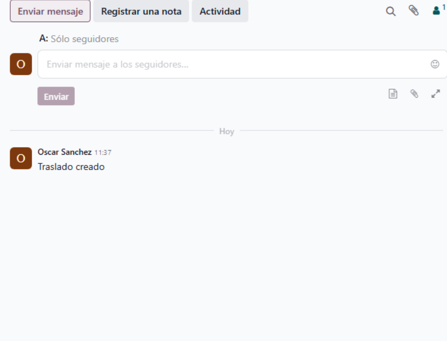

---

### 3.4 Validar el registro

Para finalizar la recepción, haz clic en **Validar**. El estado cambiará de **Listo** a **Hecho**.

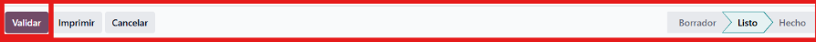

---

### 3.5 Ver y filtrar los registros

| Columna | Qué muestra |
| :--- | :--- |
| **Referencia** | El número de referencia interno (ej: `WH/IN/00001`) |
| **Contacto** | La empresa a la que se lo encargas |
| **Fecha programada** | Cuándo está previsto que llegue |
| **Documento de origen** | El número de factura vinculado |
| **Estado** | Si está **Hecho** o **Borrador** |

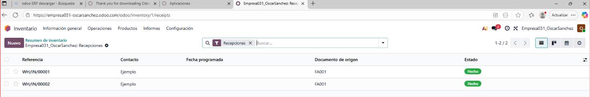

---

### 3.6 Cambiar el formato de visualización

Arriba a la derecha puedes cambiar cómo se muestran los registros. Odoo ofrece varias vistas: lista, kanban, calendario y actividades.

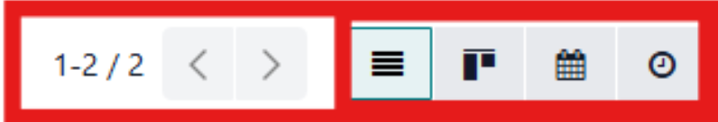

Además, arriba a la derecha puedes cambiar el formato en el que se muestran los registros. Por ejemplo, en la vista **kanban** se ven las recepciones como tarjetas, donde de un vistazo puedes ver la referencia, el contacto y el estado de cada una (**Hecho** o pendiente).

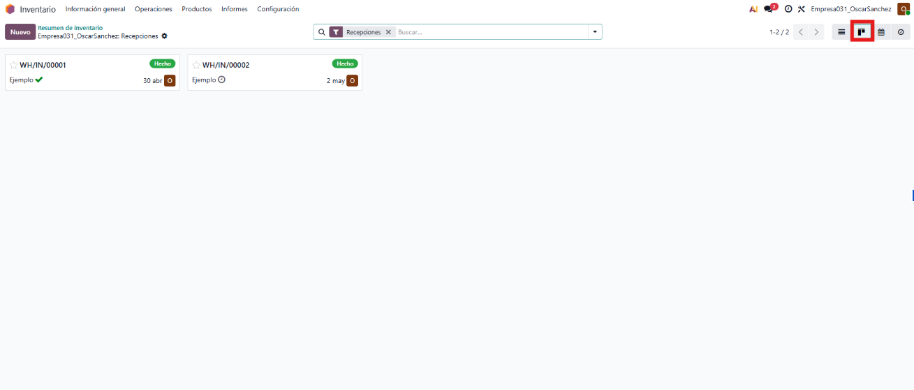

Al cambiar al formato de **lista**, podemos ver todos los registros de forma más ordenada, con las columnas de **Referencia**, **Contacto**, **Fecha programada**, **Documento de origen** y **Estado** bien visibles de un vistazo.

 
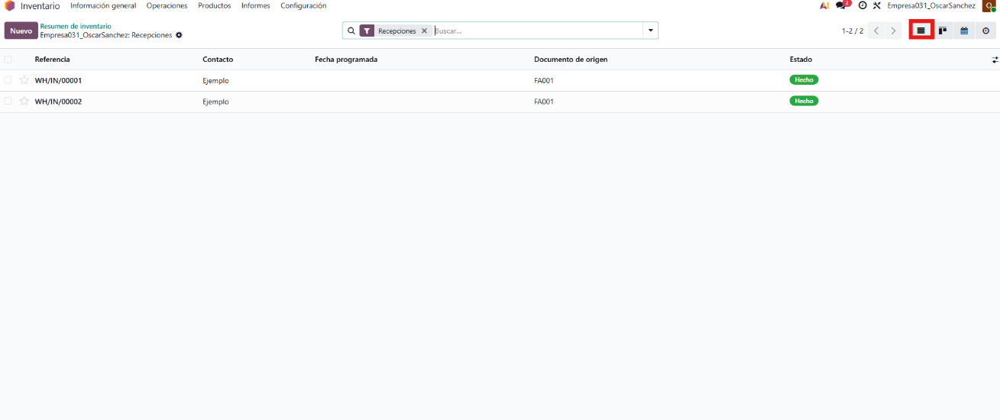

En la vista de **actividades** podemos ver las tareas pendientes asociadas a cada recepción, organizadas por tipo: **Actividades pendientes**, **Correo electrónico**, **Llamada**, **Reunión** y **Documento**. También puedes planificar nuevas actividades desde el botón **+ Planificar actividad**.

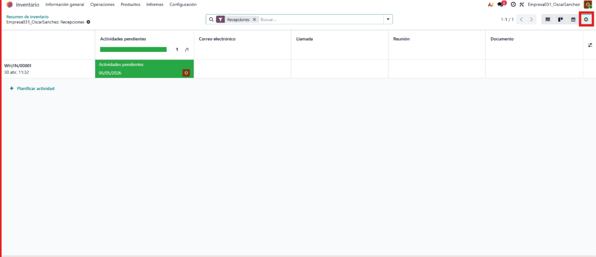

En la vista de **calendario** puedes ver las recepciones colocadas en el día y hora en que están programadas. Es útil para tener una visión general de cuándo va a llegar cada pedido a lo largo de la semana.

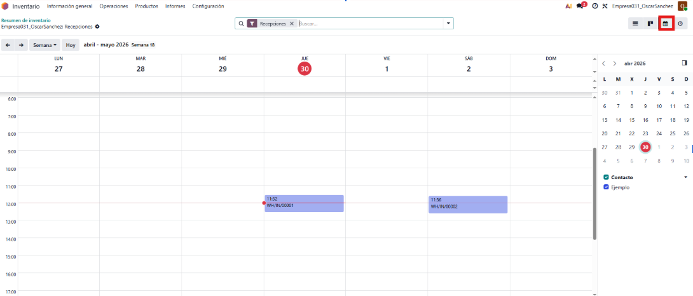

> Las **Órdenes de entrega** funcionan exactamente igual que las recepciones, pero en sentido contrario: en lugar de recibir productos, los estás enviando a un cliente.
-----
## 4. Backups y Restauración

Hacer copias de seguridad de la base de datos es fundamental para no perder nada. Odoo tiene dos maneras de hacerlo.

### 4.1 Primera manera — Desde la configuración del usuario

1. Haz clic en el **icono de usuario** (arriba a la derecha) y selecciona **Mis bases de datos**.
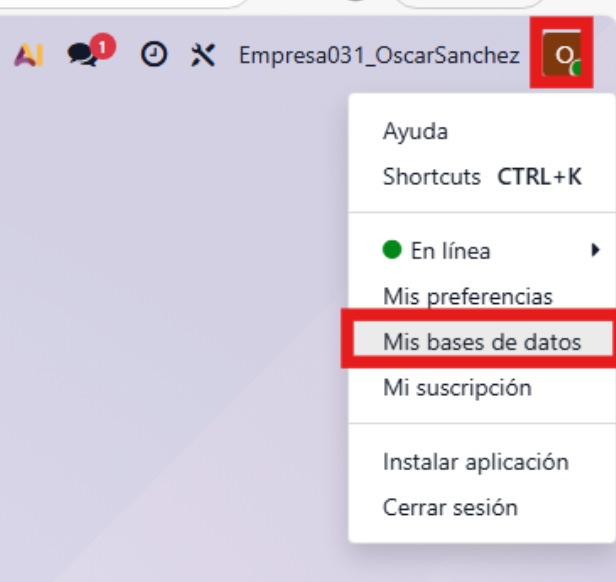

2. Busca tu base de datos en la lista y haz clic en los tres puntos `···` → **Gestionar**.

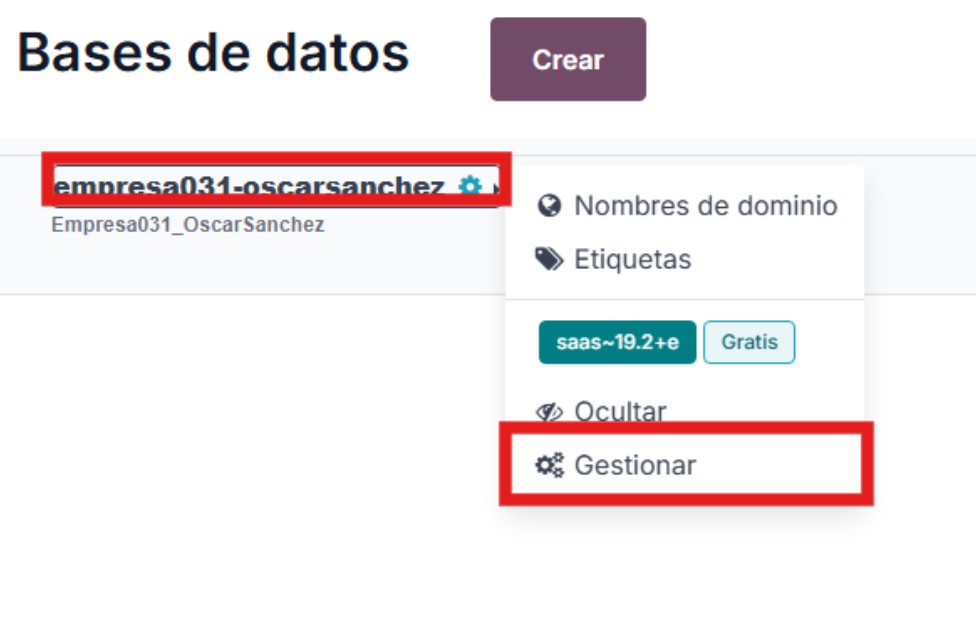

3. En la sección **Copias de seguridad**, haz clic en **Descargar copia de seguridad**. Se descargará un archivo `.zip`.

### 4.2 Segunda manera — Desde el gestor de bases de datos

1. Cierra sesión en Odoo.
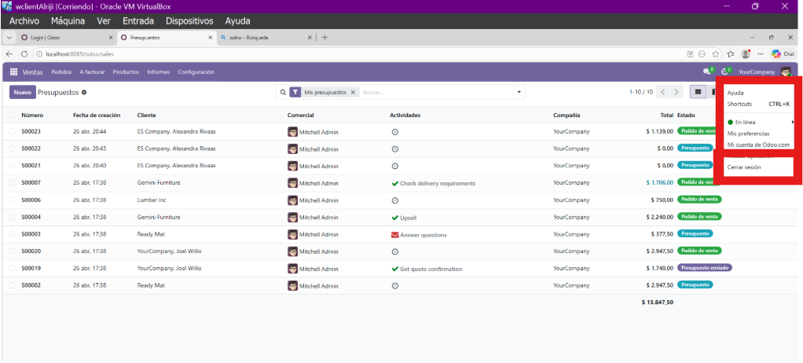

2. En la pantalla de login, haz clic en **Gestionar bases de datos** (abajo del todo).
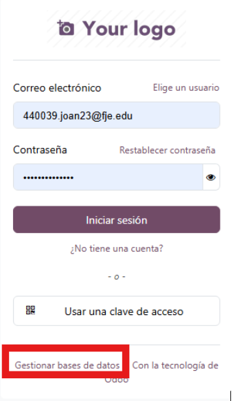

3. Busca tu base de datos y haz clic en **Backup**. Rellena el formulario:

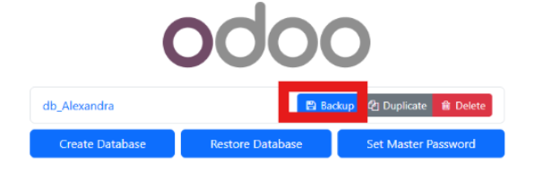

### 4.3 Verificación del backup
- **Recordatorio**
   - **Master Password** --> la que guardaste al crear la base de datos.
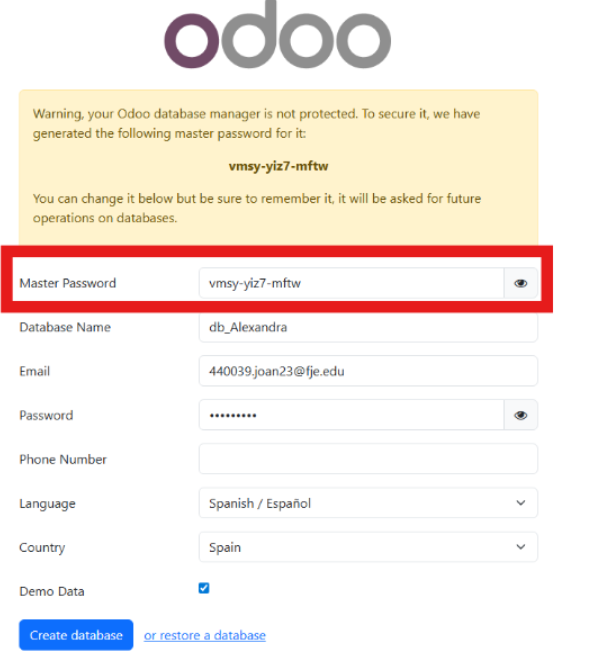
    - **Master Password** --> El mismo password
   - **Backup Format** -->`zip`.
   - Deja marcado **Include filestore**.
   - Haz clic en **Backup** para descargar.
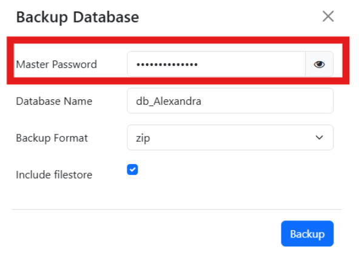

Se nos descargará un archivo `.zip` con el nombre de la base de datos y la fecha en la que se ha realizado la copia (ej: `db_Alexandra_2026-04-30_10-47-15.zip`).

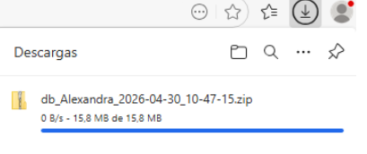

### 4.4 Restauración desde el backup del compañero (Oscar)

Para restaurar la base de datos de tu compañero en tu Odoo, ve al gestor de bases de datos y haz clic en **Restore Database**.

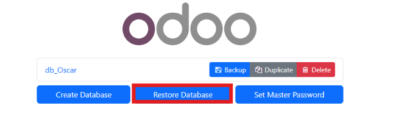

Rellena el formulario de restauración:

| Campo | Qué poner |
| :--- | :--- |
| **Master Password** | Tu Master Password (Oscar) |
| **File** | El archivo `.zip` del backup (Alexandra) |
| **Database Name** | Un nombre nuevo para distinguirla (`Ale`) |
| **This database is a copy** | Marca esta opción |

Haz clic en **Continue** y espera a que termine. Una vez restaurada, ya puedes seleccionarla desde la pantalla de login e iniciar sesión con las credenciales del compañero.

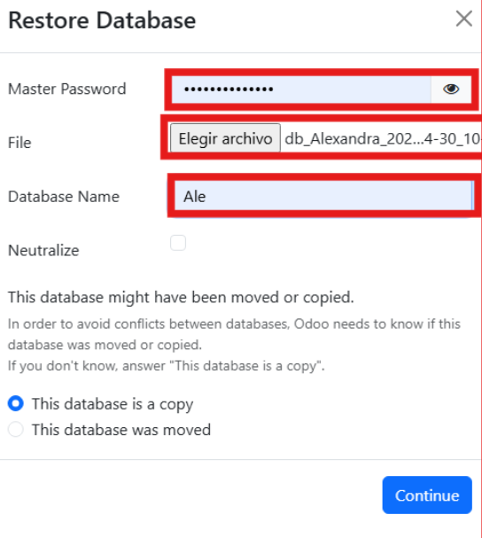

Al intentar iniciar sesión con las credenciales del compañero (Alexandra), y colocaremos  el **correo** y la **contraseña** correctos con los que se creó esa base de datos.

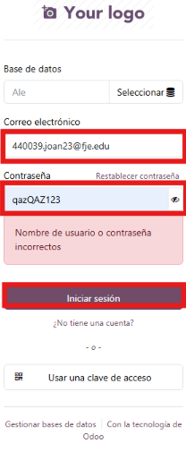

 En este caso se puede ver que  ha podido entrar a la base de datos de **Alexandra** y visualizar todos sus presupuestos y pedidos de venta sin ningún problema.

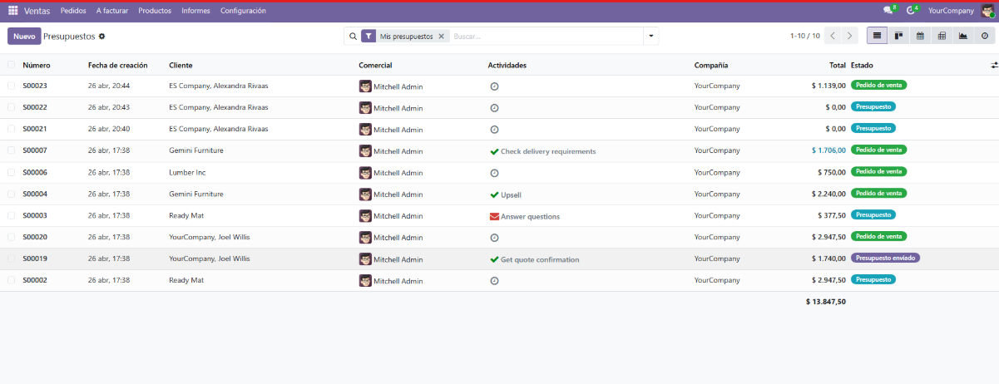

